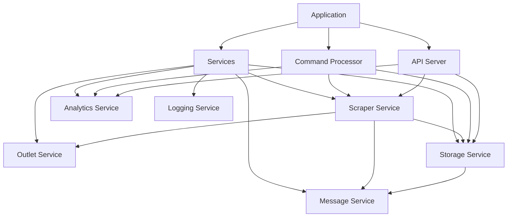

# Component Documentation

This directory contains detailed documentation for each Messor component.

## 📁 Component Structure

### **Core Components**
- **[Application](./core-application.md)** - Main application orchestrator
- **[Command Processor](./core-command-processor.md)** - CLI command handling
- **[Configuration](./core-configuration.md)** - Configuration management

### **Service Components**
- **[Scraper Service](./service-scraper.md)** - Web scraping orchestration
- **[Outlet Service](./service-outlet.md)** - News outlet management
- **[Storage Service](./service-storage.md)** - Data persistence
- **[Message Service](./service-message.md)** - RabbitMQ messaging
- **[Analytics Service](./service-analytics.md)** - Statistics and reporting
- **[Logging Service](./service-logging.md)** - Centralized logging

### **API Components**
- **[FastAPI Server](./api-server.md)** - REST API endpoints
- **[WebSocket Handler](./api-websocket.md)** - Real-time communications

### **Client Components**
- **[React Dashboard](./client-dashboard.md)** - Web-based monitoring interface
- **[Service Layer](./client-services.md)** - Frontend service abstractions

## 🎯 Documentation Standards

Each component documentation includes:

### **Overview Section**
- Purpose and responsibilities
- Key features and capabilities
- Dependencies and relationships

### **API Documentation**
- Public methods and parameters
- Return types and exceptions
- Usage examples

### **Configuration**
- Configuration options
- Environment variables
- Default values

### **Error Handling**
- Exception types
- Error codes and messages
- Recovery strategies

### **Testing**
- Unit test coverage
- Integration test scenarios
- Mock configurations

## 📋 Component Interface Standards

### **Service Interface**
```python
class ServiceInterface:
    \"\"\"Base interface for all services.\"\"\"
    
    def __init__(self, config, logger, **dependencies):
        \"\"\"Initialize service with dependencies.\"\"\"
        pass
    
    def start(self) -> bool:
        \"\"\"Start the service. Returns success status.\"\"\"
        pass
    
    def stop(self) -> bool:
        \"\"\"Stop the service gracefully.\"\"\"
        pass
    
    def health_check(self) -> dict:
        \"\"\"Return service health status.\"\"\"
        pass
```

### **Configuration Access Pattern**
```python
# Standard configuration access
config_value = self.config.section.subsection.value

# With fallback
config_value = getattr(self.config.section, 'value', default_value)

# Type-safe access
interval = self.config.get_schedule_interval_minutes()
```

### **Logging Pattern**
```python
# Structured logging with context
self.logger.info("Operation started", extra={
    "component": "scraper_service",
    "operation": "scrape_outlets",
    "session_id": session_id
})

# Error logging with exception
self.logger.error(f"Failed to process outlet: {outlet_name}", 
                 exc_info=True)
```

## 🔗 Component Dependencies



## 🧪 Testing Guidelines

### **Unit Testing**
- Each component has isolated unit tests
- Mock external dependencies
- Test error conditions and edge cases
- Minimum 80% code coverage

### **Integration Testing**
- Test component interactions
- Use real configurations in test environment
- Verify data flow between components
- Test failure scenarios and recovery

### **End-to-End Testing**
- Full system workflow testing
- Docker container testing
- API endpoint testing
- Client dashboard testing

## 📚 Quick Navigation

| Component | Purpose | Key Methods |
|-----------|---------|-------------|
| **Application** | System orchestration | `run()`, `_run_scheduled_mode()` |
| **Command Processor** | CLI interaction | `process_commands()`, `execute_scraping()` |
| **Scraper Service** | Web scraping | `execute_scraping_process()` |
| **Outlet Service** | Source management | `get_outlets()` |
| **Storage Service** | Data persistence | `save_articles()`, `upload_to_cloud()` |
| **Message Service** | Event messaging | `publish()`, `consume()` |

For detailed information about each component, navigate to the respective documentation file.