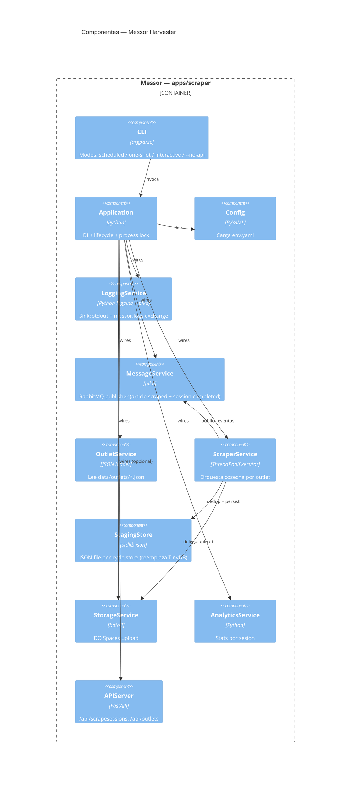
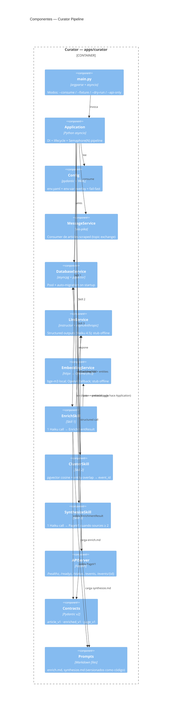
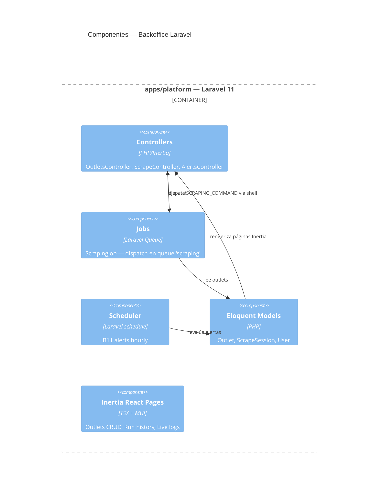

# Vista de Componentes — InkBytes (C4 L3)

Esta vista descompone cada contenedor relevante en sus componentes
internos. Para componentes individuales con su contrato detallado ver
[components/](../components/).

## 1. Messor (apps/scraper) — Componentes



### Responsabilidades por capa (Messor)

| Capa | Componentes | Patrón | Responsabilidad |
|---|---|---|---|
| Presentación | `CLI`, `APIServer` | argparse / FastAPI | Entradas (CLI, HTTP) |
| Aplicación | `Application`, `ScraperService` | Service Layer + DI | Orquestación del agente |
| Dominio | `models.outlets`, `models.articles` (en `packages/inkbytes`) | DDD pobre | Tipos del dominio |
| Infraestructura | `StorageService`, `MessageService`, `StagingStore` | Repository / Adapter | I/O |

## 2. Curator (apps/curator) — Componentes



### Loop del pipeline (Curator)

```text
Application._handle_event(payload)
  │
  ├─► db.upsert_article_raw(article, spaces_key)       — fila raw
  │
  ├─► enrich.run(article)              → EnrichmentResult (LLM)
  │
  ├─► embed.embed(title + text[:4000]) → list[float] (1024-dim bge-m3)
  │
  ├─► db.write_enrichment(...)         — persist enrichment + embedding + entities
  │
  ├─► cluster.run(article_id, embedding, entities, ...)  → ClusterResult
  │
  └─► if cluster.source_count ≥ min_sources_to_publish:
         synthesize.run(event_id)      → PageV1 (LLM); INSERT pages
```

## 3. Backoffice (apps/platform) — Componentes (resumen)



El detalle de Backoffice se mantiene como deuda documental hasta v0+1 — ver
[components/backoffice.md](../components/backoffice.md) para la ficha de alto nivel.

## 4. Reader (apps/web) — Componentes (placeholder)

Reader aún no está scaffoldeado al cierre de este SAD. Diseño previsto:

| Componente | Tecnología | Rol |
|---|---|---|
| `/` (Home) | Next.js Server Component | Lista de eventos top (lee `/events` de Curator API) |
| `/event/[id]` | Server Component | Renderiza `PageV1`: headline, synthesis_md (mdx), evidence_rail, entities |
| Layout / Tema | Tailwind + tipografía propia | Brand voice — pendiente de lock |
| Auth gate v0 | Middleware password compartido | Single shared password (env) |
| Auth gate v1 | Magic link (Resend) | Post-MVP |
