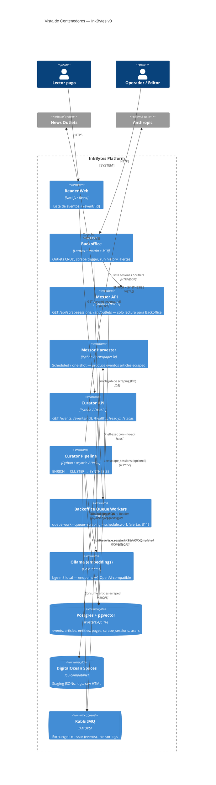

# Vista de Contenedores — InkBytes (C4 L2)

## Diagrama C4 — Nivel 2: Contenedores

## Catálogo de contenedores

| Contenedor | Tecnología | Puerto | Responsabilidad | Equipo dueño |
|---|---|---|---|---|
| `reader` | Next.js 14 / React | 3000 | UI pública: lista de eventos + página de evento | Front |
| `backoffice` | Laravel 11 + Inertia + MUI | 8080 | Admin: outlets, scrape trigger, history, alertas B11 | Platform |
| `messor-api` | Python 3.11 / FastAPI | 8050 | Endpoints de lectura para Backoffice (`/api/scrapesessions`, `/api/outlets`) | Pipeline |
| `messor-worker` | Python 3.11 / newspaper3k | — | Harvester en modo scheduled o one-shot | Pipeline |
| `curator-api` | Python 3.11 / FastAPI | 8060 | Endpoints de lectura para Reader (`/events`, `/events/{id}`) | Pipeline |
| `curator-worker` | Python 3.11 / asyncio | — | Pipeline ENRICH → CLUSTER → SYNTHESIZE | Pipeline |
| `queue-worker` | PHP CLI | — | `queue:work --queue=scraping` (dispara scrape) + `schedule:work` (alertas B11) | Platform |
| `ollama` | Go (binario) | 11434 | `bge-m3` local; endpoint OpenAI-compatible `/v1/embeddings` | Platform |
| `postgres` | PostgreSQL 16 + pgvector | 5432 | System of record | Platform |
| `rabbitmq` | CloudAMQP / DO managed | 5672 / 15672 | Event spine + log fan-out | Platform |
| `spaces` | DO Spaces (S3) | 443 | Artefactos staging/history | Platform |

## Comunicación entre contenedores

| Origen | Destino | Protocolo | Formato | Sincrónico | Schema |
|---|---|---|---|---|---|
| `reader` | `curator-api` | HTTPS | JSON | Sí | — |
| `backoffice` | `messor-api` | HTTP | JSON | Sí | — |
| `backoffice` | `queue-worker` (vía Postgres) | DB-backed | — | Sí (enqueue) | Laravel jobs |
| `queue-worker` | `messor-worker` | `exec` | CLI args | Sí | `SCRAPING_COMMAND` env |
| `messor-worker` | `spaces` | HTTPS (S3) | JSON files | Sí | per-cycle staging JSON |
| `messor-worker` | `rabbitmq` | AMQPS | JSON | No (publish + confirm) | `inkbytes.article.v1` · `scrape.session.completed` |
| `curator-worker` | `rabbitmq` | AMQPS | JSON | No (consume) | `inkbytes.article.v1` |
| `curator-worker` | `ollama` | HTTP | OpenAI-compat | Sí | `/v1/embeddings` |
| `curator-worker` | `anthropic` | HTTPS | JSON / tool_use | Sí | `EnrichmentResult` / `PageV1` |
| `curator-worker` | `postgres` | TCP/SSL | SQL + pgvector | Sí | schema 001 |
| `curator-api` | `postgres` | TCP/SSL | SQL | Sí | read-only views |

## Notas operativas

- **`messor-worker` con `--no-api`** se ejecuta cuando el queue worker lo dispara,
  para coexistir con `messor-api` que ya tiene el puerto 8050. Sin ese flag,
  el worker intentaría bindear el puerto y morir.
- **Backoffice requiere DOS procesos de fondo** (Laravel): `queue:work --queue=scraping --timeout=0` y `schedule:work`. Sin ellos, el botón "▶ Iniciar Scraping" encola pero no ejecuta.
- **El cliente React legado fue retirado** en B12.3 (ADR-0001 "one admin"). El Backoffice es el único admin.
