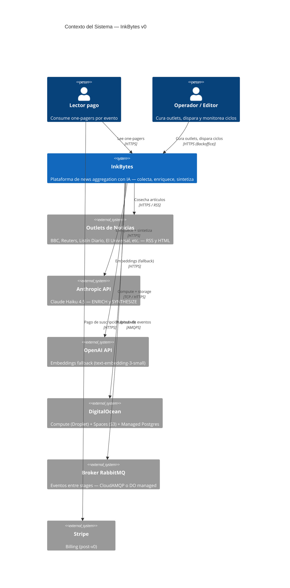

# Vista de Contexto — InkBytes (C4 L1)

## Descripción

InkBytes ingiere noticias de outlets curados, las enriquece con un LLM,
las clusteriza por evento, y publica una página por evento al lector
pagado. Un administrador interno cura outlets y dispara ciclos.

## Diagrama C4 — Nivel 1: Contexto

## Actores y sistemas externos

| Actor / Sistema | Tipo | Relación | Protocolo/Canal |
|---|---|---|---|
| Lector pago | Usuario externo | Consume el Reader | HTTPS |
| Operador / Editor | Usuario interno | Usa Backoffice (Laravel) | HTTPS |
| Outlets de Noticias | Sistemas externos públicos | Provee HTML/RSS | HTTPS |
| Anthropic | Servicio externo (SaaS) | LLM (Haiku 4.5) | HTTPS / REST |
| OpenAI | Servicio externo (SaaS, fallback) | Embeddings | HTTPS / REST |
| Ollama local | Servicio local (Droplet) | Embeddings (primario) | HTTP (`/v1` OpenAI-compatible) |
| DigitalOcean Spaces | Storage (cloud) | Artefactos | HTTPS (S3) |
| DigitalOcean Managed Postgres | DB (cloud) | System of record | TCP/SSL |
| Broker RabbitMQ | Mensajería (externa o managed) | Event spine | AMQPS |
| Stripe | Billing (post-v0) | Suscripciones | HTTPS |

## Fronteras del sistema

**Dentro del alcance v0:**
- Cosecha (Messor), pipeline LLM (Curator), Reader (Next.js), Backoffice (Laravel)
- Persistencia en Postgres + pgvector
- Artefactos en DO Spaces (o MinIO en dev)
- Event spine RabbitMQ entre Messor y Curator
- Admin (operador interno) en Backoffice

**Fuera del alcance v0:**
- App móvil nativa
- API pública B2B
- Internacionalización del Reader (i18n)
- Pagos en producción (Stripe) — se pospone post-MVP, contraseña compartida en v0
- Separación de Curator en tres servicios (Entopics / Synochi / Unitas) — post-MVP
- Indicadores de bias por outlet (left/center/right) — post-MVP
- Notificaciones / digest por email — post-MVP
