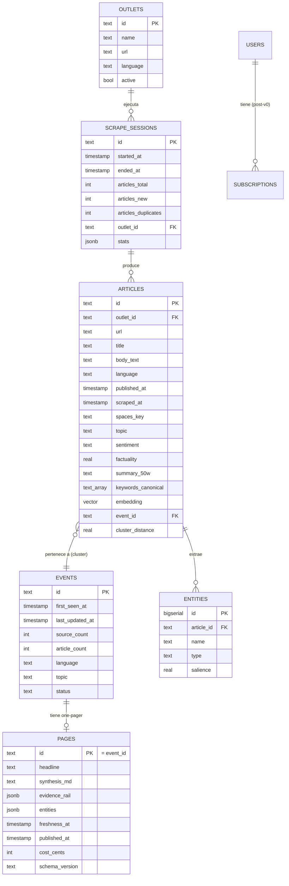
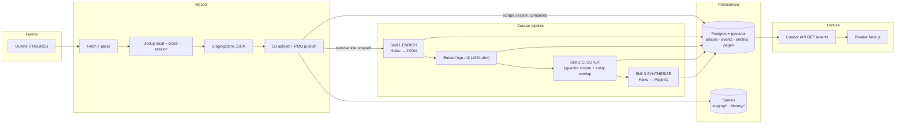

# Arquitectura de Datos — InkBytes v0

## Modelo conceptual de dominio

## Ownership de tablas (quién escribe qué)

| Tabla | Escritor primario | Escritor secundario | Lector |
|---|---|---|---|
| `outlets` | Backoffice (admin CRUD) | — | Messor, Curator (read-only) |
| `scrape_sessions` | Curator (consume `scrape.session.completed`, ADR-0006) | — | Backoffice (run history), Messor API |
| `articles` | Curator (enrich + cluster) | — | Curator API, Reader (vía API) |
| `entities` | Curator (enrich) | — | Curator (cluster + synth) |
| `events` | Curator (cluster + synth) | — | Curator API |
| `pages` | Curator (synth) | — | Curator API, Reader |
| `users` | Backoffice (post-v0) | — | — |

## Flujo de datos (Data Flow)

## Estrategia de persistencia

| Datos | Store | Tecnología | Justificación |
|---|---|---|---|
| Sistema de registro (eventos, artículos, páginas) | Primario | Postgres 16 + pgvector | ACID + búsqueda vectorial sin DB adicional |
| Embeddings | Primario | pgvector `vector(1024)` (bge-m3) | Misma DB; índice IVFFlat con `lists=100` para v0 |
| Artefactos staging (JSONs) | Frío inmediato | DO Spaces — prefijo `messor/staging/` | TTL 7 días vía lifecycle |
| Archivos históricos | Frío archivado | DO Spaces — prefijo `messor/history/` | TTL 90 días, luego eliminados |
| Logs estructurados | Stream | RabbitMQ `messor.logs` + Better Stack | Retención según plan |
| Trazas (post-v0) | Stream | OpenTelemetry → Tempo / Datadog | No en v0 |

## Importante — alineación de dimensionalidad

> ⚠️ **El schema migration actual usa `vector(1536)`** (OpenAI text-embedding-3-small) pero el embedding primario es ahora **bge-m3 (1024-dim)** vía Ollama (ADR-0003 de Curator). **Reconciliar antes de v0:**
>
> 1. Editar `Curator/apps/curator/db/migrations/001_initial_schema.sql` → `vector(1024)`.
> 2. `TRUNCATE pages, entities, articles, events CASCADE; ALTER TABLE articles ALTER COLUMN embedding TYPE vector(1024);` o reset completo del schema.
> 3. Actualizar `EmbedCfg.dimensions: 1024` en `core/config.py` y `env.example.yaml`.
> 4. Anotarlo en risk register (R-011) hasta resolverse.

## Datos sensibles y clasificación

| Categoría | Datos | Clasificación | Cifrado en reposo | Cifrado en tránsito | Retención |
|---|---|---|---|---|---|
| Contenido público (artículos) | title, body_text, url | Público | DB at-rest (DO managed) | TLS 1.3 | Indefinida |
| Metadatos de procesamiento | entities, embedding, factuality | Interno | Idem | Idem | Vinculado al artículo |
| Credenciales (API keys, DB pass) | env vars | Confidencial | — (no en disco) | — | Rotación trimestral |
| Reader account (post-v0) | email, password hash | Confidencial | bcrypt + DB at-rest | TLS 1.3 | Mientras suscripción + 30 días |
| Stripe customer (post-v0) | customer_id, last4 | Restringido | DB at-rest | TLS 1.3 | Según PCI-DSS |

## Backup y restore

| Tabla / Store | Frecuencia | RPO | Mecanismo | Pruebas de restore |
|---|---|---|---|---|
| Postgres (todas) | Daily | 24 h | DO Managed Backups | Pendiente: test mensual en v0 |
| DO Spaces | Continuo (versionado) | 0 | Versioning + lifecycle | Restore puntual desde versión anterior |
| RabbitMQ | — | best-effort | Spool local en Messor | Manual replay desde S3 |

## Migración / evolución de schema (gap conocido)

- **No hay migrations runner formal**. `database_service._ensure_schema()` aplica `001_initial_schema.sql` solo si la tabla `articles` no existe. Cualquier cambio sobre tablas pobladas requiere drop+reapply o ALTER manual.
- **Sprint-2**: introducir `schema_migrations` table con versiones + un runner ligero (asyncpg-migrate o sqitch).
- **Bumping schema del evento RabbitMQ**: crear cola paralela `v2`, consumidor doble lectura, deprecar `v1` tras 30 días.
