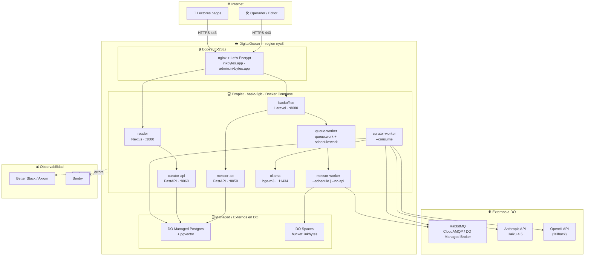
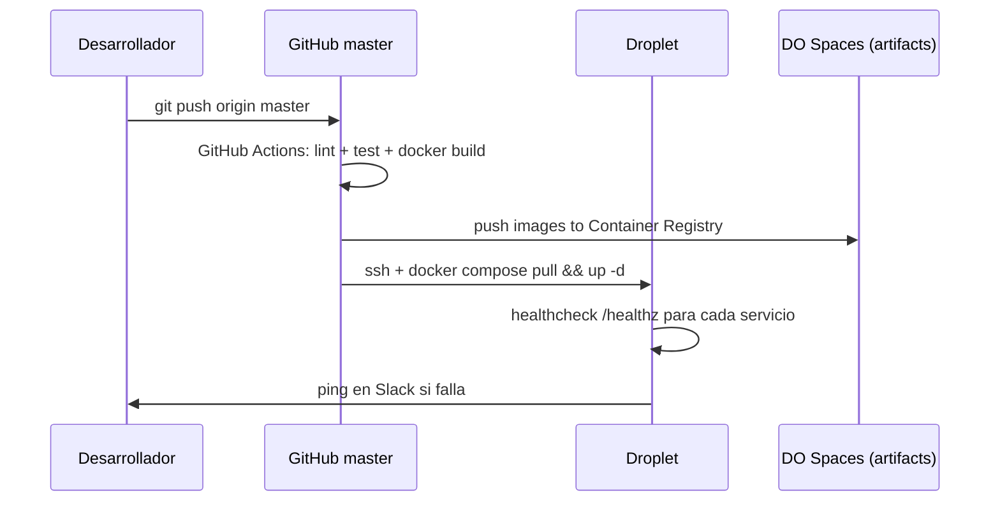

# Vista de Deployment — InkBytes v0

## Diagrama de Deployment



## Inventario de nodos

| Nodo | Rol | Plataforma | CPU | RAM | Almacenamiento | Redundancia |
|---|---|---|---|---|---|---|
| `inkbytes-droplet` | App/Worker/Edge | DO basic-2gb (Ubuntu 24.04) | 2 vCPU | 2 GB | 60 GB SSD | 1 instancia (v0) |
| `inkbytes-db` | DB primaria | DO Managed Postgres (db-s-1vcpu-1gb) | 1 vCPU | 1 GB | 10 GB SSD + WAL | Daily backup |
| `inkbytes-spaces` | Object store | DO Spaces (S3) | — | — | 250 GB incluidos | 3-way geo-redundancy |
| `inkbytes-rmq` | Broker | CloudAMQP "Little Lemur" o DO Managed | — | — | — | Free tier o paid |

## Estrategia de red

| Zona | CIDR / Lugar | Componentes | Acceso entrada | Acceso salida |
|---|---|---|---|---|
| Internet | público | Usuarios | — | — |
| Edge | Droplet :443 | nginx + LE certs | Internet (TCP 443) | App tier (loopback) |
| App | loopback Droplet | reader, backoffice, curator-*, messor-* | Edge | DB, Spaces, RMQ, Anthropic, OpenAI |
| Data | DO VPC privado | DO Managed Postgres | App tier (DO VPC) | — |
| Bus | externo | RabbitMQ | App tier (AMQPS 5672) | — |
| Storage | público con keys | DO Spaces | App tier (HTTPS) | — |

**Firewall del Droplet (UFW):**
- IN: 22 (ssh, llaves), 80 (LE renew), 443 (HTTPS público)
- OUT: 443 (Anthropic, OpenAI, Spaces), 5672 (RabbitMQ AMQPS), 25060 (Postgres SSL), 53 (DNS)
- TODO lo demás: deny

## Resiliencia y disponibilidad

| Componente | SLA objetivo v0 | Estrategia | RTO | RPO |
|---|---|---|---|---|
| Reader / Curator API | 99.5% | Restart=always en Docker | < 5 min | 0 (lectura de DB) |
| Postgres | 99.9% (managed) | DO managed backups daily | < 1 h | < 24 h |
| RabbitMQ | 99.5% | Spool local en Messor cuando broker caído | < 30 min | < 1 ciclo (60 min) |
| Spaces | 99.99% (DO SLA) | Versionado + lifecycle 90 días | < 5 min | 0 |
| Anthropic | externo, depende del proveedor | Tenacity retries + stub fallback | — | — |
| Ollama (embeddings primario) | best-effort local | OpenAI como fallback | < 1 ciclo | 0 |

**Estado actual (gap vs. objetivo):** v0 corre en single Droplet sin HA. R-005 en risk register.

## Despliegue — flujo



## Rollback

```bash
ssh ops@inkbytes-droplet
cd /opt/inkbytes
docker compose -f docker-compose.prod.yaml pull --policy missing
docker compose -f docker-compose.prod.yaml up -d --no-deps <service>=<previous-tag>
```

Sesiones en vuelo terminan; el siguiente ciclo usa la imagen anterior.

## Cost shape (mensual estimado)

| Item | Tier | USD |
|---|---|---|
| DO Droplet basic-2gb | 1 instancia | 24 |
| DO Managed Postgres (db-s-1vcpu-1gb) | shared | 15 |
| DO Spaces (250 GB) | base | 5 |
| CloudAMQP Little Lemur | free | 0 |
| LLM (Haiku) — 5k articles/day + 500 events/day | Anthropic | 75 |
| Embeddings — bge-m3 local | OpenAI fallback (raro) | ~1 |
| Sentry + Better Stack (free tiers) | — | 0 |
| Domain + LE SSL | — | 1 |
| **Total** | | **~120 USD/mes** |
