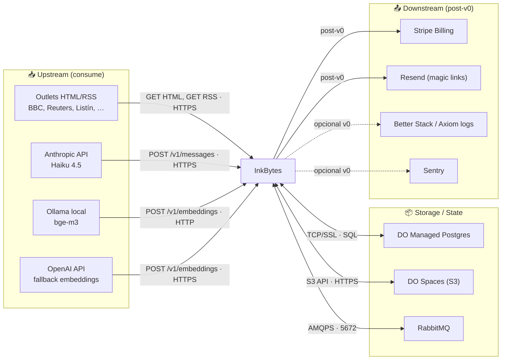

# Mapa de Integraciones — InkBytes v0

## Diagrama de integraciones

## Catálogo de interfaces

| # | Sistema | Dirección | Protocolo | Formato | Frecuencia | Auth | Descripción |
|---|---|---|---|---|---|---|---|
| IF-001 | Outlets (HTML/RSS) | Outbound (pull) | HTTPS | HTML / XML RSS | 60 min / outlet | User-Agent identificable | Cosecha por Messor |
| IF-002 | Anthropic `/v1/messages` | Outbound | HTTPS | JSON (instructor tool_use) | Por artículo + por evento | API Key (env) | ENRICH y SYNTHESIZE |
| IF-003 | Ollama `/v1/embeddings` | Outbound (intra-droplet) | HTTP | OpenAI-compat JSON | Por artículo | Ninguna (loopback) | Embedding primario (bge-m3) |
| IF-004 | OpenAI `/v1/embeddings` | Outbound (fallback) | HTTPS | OpenAI JSON | Cuando Ollama no está | API Key | Embedding fallback |
| IF-005 | DigitalOcean Spaces | Bidireccional | HTTPS (S3 v4) | Binary / JSON | Por ciclo | Spaces key / secret | Staging + history |
| IF-006 | DO Managed Postgres | Bidireccional | TCP/SSL | SQL + pgvector | Continuo | Cert-based / password | System of record |
| IF-007 | RabbitMQ `messor` exchange | Outbound (Messor) → Inbound (Curator) | AMQPS | JSON | Continuo | User/pass + TLS | Eventos `article.scraped`, `session.completed` |
| IF-008 | RabbitMQ `messor.logs` exchange | Outbound (todos) | AMQPS | JSON | Continuo | Mismo | Log fan-out |
| IF-009 | Backoffice → Messor API | Outbound | HTTP/JSON | JSON | On-demand admin | Token / Laravel session | Lista sesiones, outlets |
| IF-010 | Reader → Curator API | Outbound | HTTPS | JSON | Por carga de página | Ninguna v0 (single shared password en el Reader) | Lista eventos, página evento |
| IF-011 | Stripe (post-v0) | Bidireccional | HTTPS | JSON | On-checkout / webhook | API Key + webhook secret | Suscripciones |
| IF-012 | Resend (post-v0) | Outbound | HTTPS | JSON | Magic links | API Key | Email auth |
| IF-013 | Sentry (opcional) | Outbound | HTTPS | JSON | On-error | DSN | Error tracking |
| IF-014 | Better Stack / Axiom | Outbound | HTTPS | JSON | Continuo | API Key | Log shipping |

## Matriz de criticidad de integraciones

| Interfaz | Criticidad | Impacto si falla | Timeout | Retry | Fallback |
|---|---|---|---|---|---|
| IF-001 Outlets | Media | Sin nuevos artículos en este ciclo (otros outlets siguen) | 30 s/req | 3× exp backoff (newspaper3k) | Skip outlet, marcar en analytics |
| IF-002 Anthropic | Alta | Sin enrichment ni synthesis hasta que vuelva | 60 s | Tenacity 3× + jitter | Stub mode (degrada calidad) o retry siguiente ciclo |
| IF-003 Ollama | Alta (con fallback) | Sin embeddings primarios | 10 s | 2× retry | OpenAI (IF-004) |
| IF-004 OpenAI | Baja (fallback) | Sin fallback de embeddings | 30 s | 2× retry | Skip embedding, no cluster en este ciclo |
| IF-005 Spaces | Alta | Sin upload de artefactos | 30 s | Tenacity 3× | Mantener staging local; reintentar siguiente ciclo |
| IF-006 Postgres | Crítica | Pipeline detenido | 5 s connect, 60 s query | asyncpg retry pool | aio-pika requeue del mensaje |
| IF-007 RabbitMQ events | Crítica | Sin spine entre Messor y Curator | 30 s connect | aio-pika robust reconnect | Spool local (Messor `data/rabbit/queue.json`) |
| IF-008 RabbitMQ logs | Baja | Logs solo en stdout | 30 s | Reconnect | stdout (no se pierde nada esencial) |
| IF-009 BO → Messor API | Media | Admin no ve sesiones/outlets | 5 s | UI lo expone | Mensaje "datos no disponibles" |
| IF-010 Reader → Curator API | Crítica para UX | Página no carga | 5 s | Next.js fetch retry | Página de error con retry button |

## Schemas en el bus (RabbitMQ)

| Routing key | Schema | Producer | Consumer | Versionado |
|---|---|---|---|---|
| `event.article.scraped` | `inkbytes.article.v1` | Messor | Curator | Major bump en `v2` con cola paralela |
| `scrape.session.completed` | `inkbytes.session.v1` (ADR-0006) | Messor | Curator | Idem |
| `logs.*` | log JSON ad-hoc | Todos | Better Stack shipper | No versionado (best-effort) |

Detalle del schema `inkbytes.article.v1`: ver
[`Messor/docs/contracts.md`](../../../Messor/docs/contracts.md) §2.
