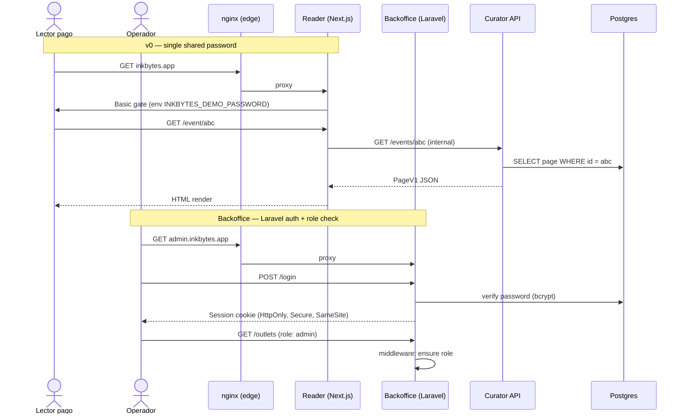

# Vista de Seguridad — InkBytes v0

## Modelo de amenazas (STRIDE resumen)

| Amenaza | Componente en riesgo | Control implementado | Estado |
|---|---|---|---|
| **S**poofing — identidad falsificada | Reader (post-v0) | Magic-link Resend (post-MVP); v0 = single shared password | 🔄 Parcial (v0 mínimo) |
| **S**poofing — outlet servirá HTML manipulado | Messor | User-Agent claro + sanitización newspaper3k; sin ejecución | 🔄 Parcial (no firmamos contenido scrapeado) |
| **T**ampering — DB | Postgres | RBAC DO + WAL + backups | ✅ |
| **T**ampering — eventos RabbitMQ | Bus | mTLS / AMQPS + user/pass por servicio | 🔄 Parcial (mTLS pendiente) |
| **R**epudiation — origen de páginas | Pages table | `evidence_rail` JSON con URLs literales por claim | ✅ |
| **I**nformation Disclosure — secretos | Code/config | Env vars + `__SET_VIA_ENV__` placeholders; nada en git | ✅ (post sanitización) |
| **I**nformation Disclosure — datos pagos | Reader | No PII en v0 (single shared password); cuando entre auth, hash bcrypt | 🔄 Parcial |
| **D**oS — API pública | Reader → Curator API | nginx rate-limit + Cloudflare en frente | 🟠 Pendiente |
| **D**oS — costos LLM | Curator | Per-cycle cost guard (post-v0); por ahora: timeout + max_concurrent | 🟠 Pendiente |
| **E**oP — admin endpoints | Backoffice | Laravel auth + admin role + queue isolation | ✅ |

## Modelo de autenticación y autorización

## Zonas de confianza

| Zona | Nivel de confianza | Componentes | Controles de acceso |
|---|---|---|---|
| Internet | Sin confianza | Lectores, atacantes | nginx + WAF (Cloudflare opcional), TLS 1.3, rate-limit |
| Edge | Baja | nginx, LE certs | Solo expone Reader (443) y Backoffice (443 con subdomain) |
| App (loopback dentro del Droplet) | Media | reader, backoffice, curator-api, messor-api | Solo accesibles desde nginx vía localhost |
| Workers (loopback) | Media | curator-worker, messor-worker, queue-worker | Sin puerto público; comunican vía RMQ/DB/exec |
| Data (DO VPC) | Alta | DO Managed Postgres | Solo desde el Droplet, IP allow-list |
| Bus (externo) | Alta (TLS) | RabbitMQ (CloudAMQP) | AMQPS + user/pass por servicio |
| Storage (externo) | Alta | DO Spaces | IAM scoped keys; bucket private |

## Gestión de secretos

| Secreto | Tipo | Almacén | Rotación | Responsable |
|---|---|---|---|---|
| `ANTHROPIC_API_KEY` | API key | env var (Droplet, Doppler/1Password local) | Trimestral o post-incidente | Owner |
| `OPENAI_API_KEY` | API key | Idem | Trimestral | Owner |
| `DATABASE_URL` | Credencial DB | env var + DO secret manager | Auto (DO managed rotation) | Platform |
| `RABBITMQ_URL` | Credencial bus | env var | Trimestral | Platform |
| `DO_SPACES_KEY` / `SECRET` | Credencial S3 | env var + DO secret | Trimestral | Platform |
| `INKBYTES_DEMO_PASSWORD` | Password compartido v0 | env var | Por usuario invitado o trimestral | Owner |
| `APP_KEY` (Laravel) | Encryption key | env var | Una vez (no rotar sin migración) | Platform |
| Certificados TLS | x509 (LE) | filesystem `/etc/letsencrypt` | Auto 90 días | nginx + certbot |

## Acción inmediata pendiente (R-009)

⚠️ El `env.yaml` legacy del repositorio tuvo secretos en texto plano (DO
Spaces, Strapi, Platform, OpenAI, RabbitMQ). Estado:

- [x] Tokens sanitizados en `env.yaml` (placeholders `__SET_VIA_ENV__`)
- [x] `env.local.yaml` en `.gitignore`
- [x] `Messor/docs/security.md` describe el plan
- [ ] **Rotación de los tokens originales** (sin confirmación)
- [ ] **Scrub de historia** con `git filter-repo` para purgar los tokens previos
- [ ] Pre-commit hook `gitleaks` o `detect-secrets`
- [ ] Secret scanning en CI

Hasta cerrar esos 4 ítems, asumir los tokens previos como comprometidos.

## Postura de red en producción

| Surface | Exposición | Notas |
|---|---|---|
| Reader (`/`) | Internet :443 | TLS 1.3, single shared password en v0 |
| Backoffice (admin subdomain) | Internet :443 | Laravel auth + admin role; ideal: IP allow-list o VPN |
| Curator API (`/healthz`, `/events`) | Interna (loopback) | Reader la consume; no expuesta al público |
| Messor API | Interna (loopback) | Backoffice la consume |
| RabbitMQ management UI | Solo dev | En prod usa el dashboard de CloudAMQP |
| MinIO console | Solo dev | No existe en prod (se usa DO Spaces console) |
| Postgres :25060 | DO VPC private | Solo desde el Droplet |

## Cumplimiento y licencias de contenido

- **Snippet-only display** — Curator publica `synthesis_md` original + citas literales bajo umbral de fair-use (≤ 400 chars por quote en `evidence_rail`). Nunca republicar texto completo.
- **Atribución obligatoria** — cada page muestra `source_name` + `url` por claim.
- **`robots.txt` respect** — Messor evita paths excluidos por el outlet; outlet a-la-carta (no scraping masivo no-autorizado).
- **GDPR** — InkBytes no procesa PII de usuarios europeos en el pipeline de noticias en v0. Cuando entre auth de Reader, agregar DSAR endpoint.
- **DR (Ley 172-13 — protección de datos)** — al entrar usuarios reales, designar oficial DPO, publicar política de privacidad.
