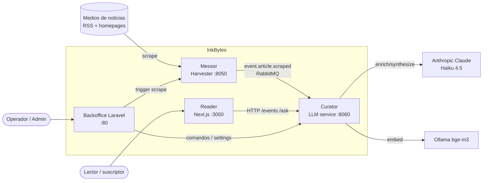

# InkBytes — Referencia de Código

> *Status: v1 · Owner: documentor-agent · Last updated: 2026-06-12*
> Documentación **a nivel de código** (módulos, APIs, schema de BD, reglas de negocio, onboarding).
> Para la vista **arquitectónica** (C4, deployment, seguridad, ADRs de sistema) ver [`docs/architecture/`](../architecture/). Para el estado vivo ver [`docs/STATUS.md`](../STATUS.md).

## ¿Qué es InkBytes?

Lector de noticias **pago y sin anuncios**: una página elegante por *evento*, sintetizada a partir de múltiples fuentes. El lector paga por saltarse el ruido.

El pipeline de largo plazo es **Messor (cosecha) → Entopics (NER+topics) → Synochi (síntesis) → Unitas (clustering+QA) → Reader**. En v0, Entopics+Synochi+Unitas se colapsan en un único servicio LLM llamado **Curator**.

## Mapa de servicios

| Servicio | Rol | Stack | Puerto | Doc por servicio |
|---|---|---|---|---|
| **Messor / scraper** | Cosechador de artículos (harvester) | Python 3.11, FastAPI 0.99, newspaper3k, pika, pydantic v1 | 8050 | `Messor/CLAUDE.md` |
| **Messor / platform** | Backoffice de operación y moderación | Laravel 11, PHP 8.4, Inertia + React | 80 / 8000 (dev) | `Messor/apps/platform/README.md` |
| **Curator** | Servicio LLM: enrich → cluster → synthesize → ask | Python 3.11, FastAPI, asyncpg, pgvector, instructor, pydantic v2 | 8060 | `Curator/CLAUDE.md` |
| **Reader** | Frontend público del lector | Next.js 16, React 19, App Router, TS | 3000 | `Reader/apps/web/CLAUDE.md` |

Infraestructura compartida: **PostgreSQL + pgvector**, **RabbitMQ**, **Ollama** (embeddings `bge-m3`), **DigitalOcean Spaces** (S3, prod) / **MinIO** (dev). Deploy: un único Droplet de DigitalOcean (`inkbytes.org`).

## Diagrama de contexto (C4 L1)



## Índice de esta referencia

### Técnico
- [`technical/stack.md`](technical/stack.md) — stack tecnológico por servicio, versiones, dependencias clave.
- [`technical/api-reference.md`](technical/api-reference.md) — todos los endpoints HTTP (Curator, Messor, Backoffice, Reader) + contratos RabbitMQ.
- [`technical/database-schema.md`](technical/database-schema.md) — tablas, columnas, relaciones, índices y pgvector (schemas `public` y `backoffice`).
- [`technical/configuration.md`](technical/configuration.md) — variables de entorno y configuración por servicio.

### Funcional
- [`functional/features.md`](functional/features.md) — funcionalidades del sistema de cara al usuario y al operador.
- [`functional/business-rules.md`](functional/business-rules.md) — reglas de negocio identificadas con su implementación (clase/método + ADR).
- [`functional/workflows.md`](functional/workflows.md) — flujos principales (cosecha→publicación, síntesis, chat) con diagramas Mermaid.

### Onboarding
- [`onboarding/getting-started.md`](onboarding/getting-started.md) — setup local paso a paso.
- [`onboarding/development-guide.md`](onboarding/development-guide.md) — convenciones, patrones y workflow obligatorio.
- [`onboarding/glossary.md`](onboarding/glossary.md) — términos del dominio.

## Cómo levantar todo (rápido)

```bash
cd /Volumes/Pragmata/Projects/InkBytes
bash orchestrator/scripts/up.sh                  # infra: Postgres, RabbitMQ, MinIO
bash orchestrator/scripts/dev-pipeline.sh up     # Curator + Messor + Reader + Backoffice
bash orchestrator/scripts/dev-pipeline.sh status # health + conteos del pipeline
```

Detalle completo en [`onboarding/getting-started.md`](onboarding/getting-started.md).
