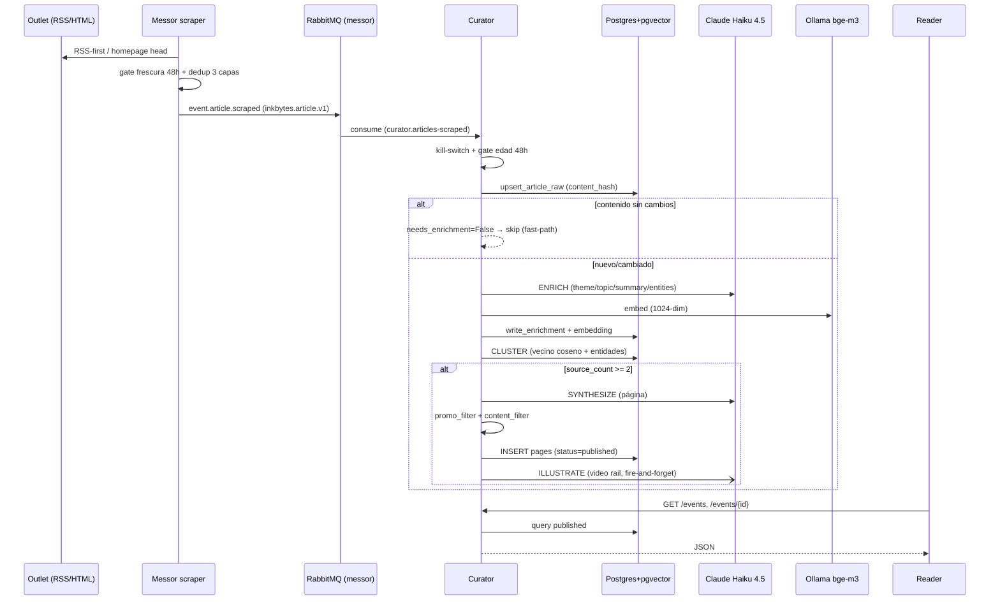
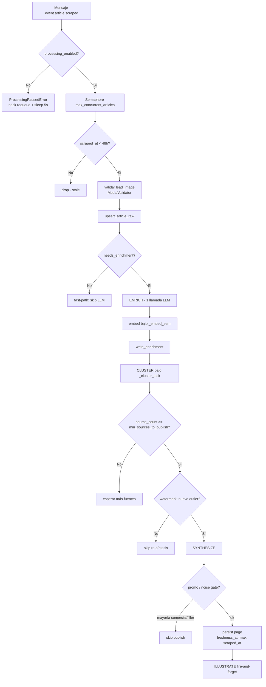
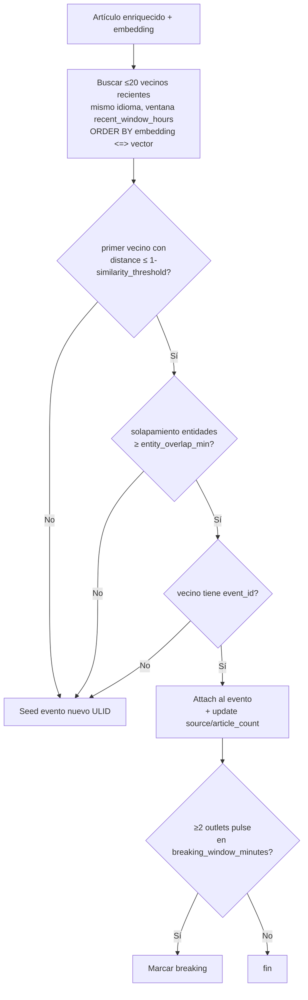
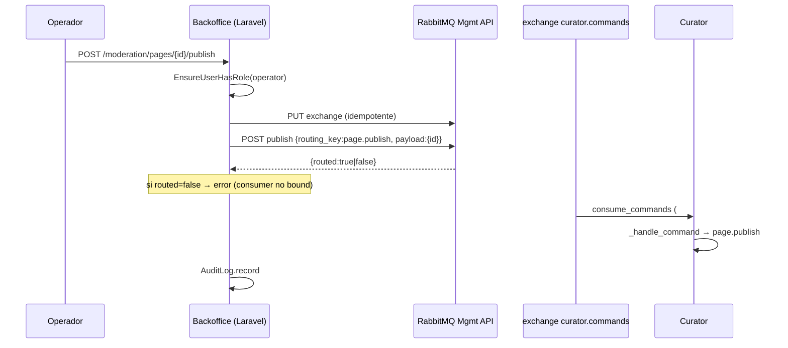
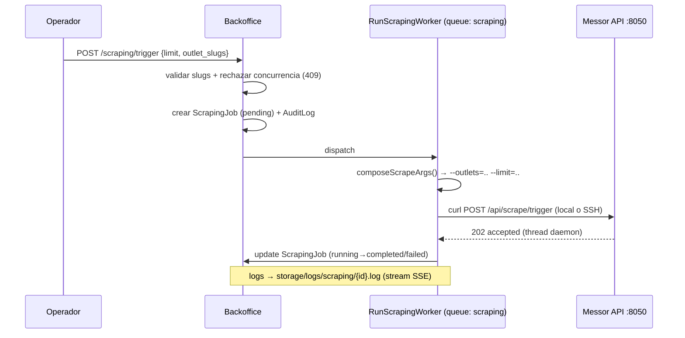
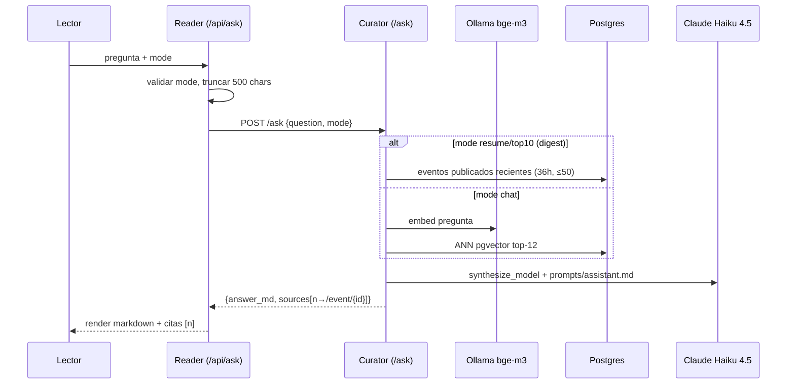

# Flujos Principales

> *Status: v1 · Owner: documentor-agent · Last updated: 2026-06-12*

## 1. Cosecha → publicación (end-to-end)

El flujo completo desde que Messor cosecha un artículo hasta que aparece en el Reader.

## 2. Pipeline interno de Curator (`_handle_event`)

## 3. Clustering (decisión attach vs. seed)

## 4. Moderación desde el Backoffice

El Backoffice no habla AMQP directamente: publica comandos vía la **HTTP management API** de RabbitMQ.

## 5. Trigger de cosecha desde el Backoffice

## 6. Asistente de chat (RAG)

