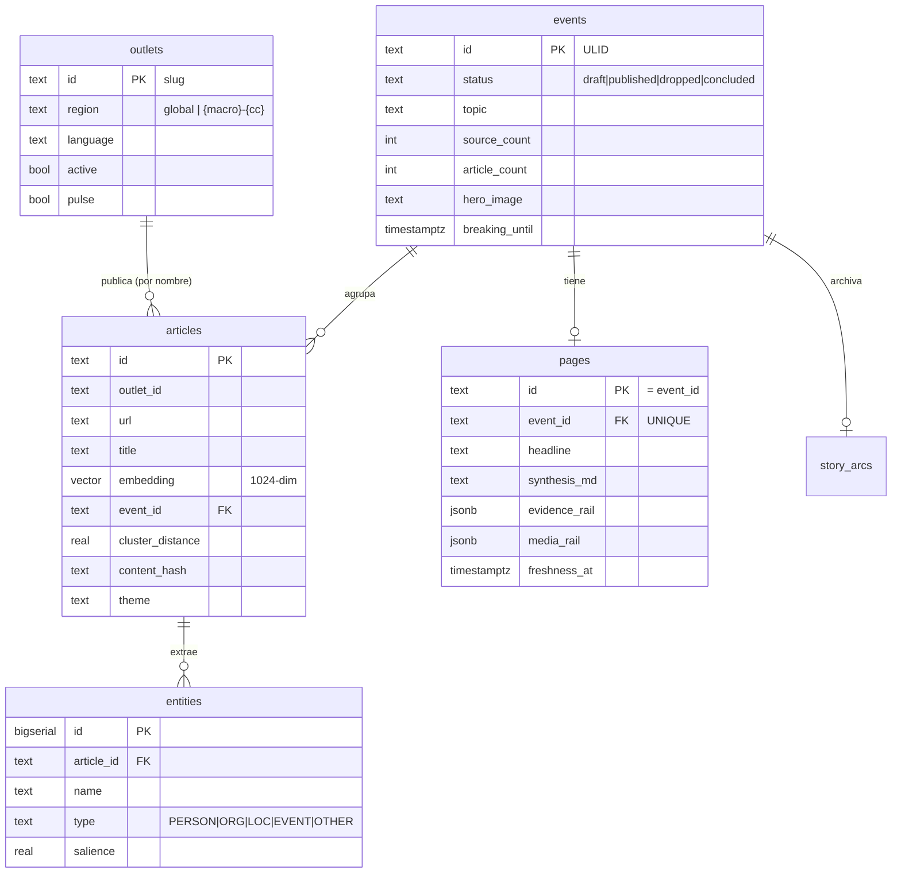

# Database Schema

> *Status: v1 · Owner: documentor-agent · Last updated: 2026-06-12*

Una sola base Postgres (`inkbytes`) con **dos schemas**:

- **`public`** — tablas del pipeline, **propiedad de Curator** (DDL en `Curator/apps/curator/db/migrations/*.sql`, aplicadas en orden 001→016). Extensiones: `vector` (pgvector), `pg_trgm`.
- **`backoffice`** — tablas operativas, **propiedad del Backoffice Laravel** (`Messor/apps/platform/database/migrations/*.php`).

El Backoffice usa `search_path = backoffice,public`, lee/escribe filas cross-schema en `public` pero **no** posee su DDL (ADR-0003). Curator lee `backoffice.curator_settings` (overlay de config) y escribe `backoffice.model_usage` (sink de costos).

## Diagrama ER (entidades principales — schema `public`)

---

## Schema `public` (Curator)

### `events`
**Propósito**: Un cluster de artículos sobre la misma historia. La unidad central del dominio.

| Columna | Tipo | Nullable | Notas |
|---|---|---|---|
| `id` | TEXT PK | No | ULID |
| `created_at` | TIMESTAMPTZ | No | DEFAULT NOW() |
| `first_seen_at` | TIMESTAMPTZ | No | |
| `last_updated_at` | TIMESTAMPTZ | No | |
| `source_count` | INT | No | DEFAULT 1 — outlets distintos |
| `article_count` | INT | No | DEFAULT 1 |
| `language` | TEXT | No | |
| `topic` | TEXT | Sí | |
| `status` | TEXT | No | DEFAULT `draft`; CHECK IN (`draft`,`published`,`dropped`,`concluded`) |
| `hero_image` | TEXT | Sí | mig. 011 |
| `breaking_at` / `breaking_until` | TIMESTAMPTZ | Sí | mig. 014 (ADR-0024) |
| `last_synth_source_count` | INT | No | DEFAULT 0; mig. 015 — watermark de re-síntesis |

**Índices**: `last_updated DESC`, `status`, `topic`, parcial sobre `breaking_until`.

### `articles`
**Propósito**: Un artículo cosechado de un outlet, enriquecido por el LLM y embebido.

| Columna | Tipo | Nullable | Notas |
|---|---|---|---|
| `id` | TEXT PK | No | |
| `outlet_id` / `outlet_name` | TEXT | No | |
| `url` | TEXT | No | |
| `canonical_url` | TEXT | Sí | |
| `title` / `body_text` | TEXT | No | |
| `language` | TEXT | No | |
| `published_at` | TIMESTAMPTZ | Sí | provisto por outlet (puede ser nulo/erróneo) |
| `scraped_at` | TIMESTAMPTZ | No | sellado por Messor en harvest (fuente de freshness) |
| `word_count` | INT | No | |
| `spaces_key` | TEXT | Sí | clave S3 |
| `raw_meta` | JSONB | Sí | |
| `enriched_at` | TIMESTAMPTZ | Sí | |
| `topic` / `sentiment` / `summary_50w` | TEXT | Sí | salida de ENRICH |
| `factuality` | REAL | Sí | CHECK 0..1 |
| `keywords_canonical` | TEXT[] | Sí | |
| `embedding` | **vector(1024)** | Sí | bge-m3; era 1536 (OpenAI), retipado por mig. 005 |
| `event_id` | TEXT FK→`events(id)` | Sí | ON DELETE SET NULL |
| `cluster_distance` | REAL | Sí | distancia coseno al evento |
| `content_hash` | TEXT | Sí | mig. 006 — dedup fast-path |
| `theme` | TEXT | Sí | mig. 007 — una de 8 verticales |
| `keywords_raw` / `meta_categories` | TEXT[] | Sí | DEFAULT `{}`; mig. 007 |
| `article_category` | TEXT | Sí | mig. 007 |
| `lead_image` / `video_url` | TEXT | Sí | mig. 008 |
| `created_at` / `updated_at` | TIMESTAMPTZ | No | trigger `set_updated_at` |

**Índices**: `scraped_at DESC`, `event_id`, `outlet_id`, `topic`, `language`, `theme`, `article_category`; **`idx_articles_embedding` IVFFlat `vector_cosine_ops` lists=100** (recreado a 1024-dim en mig. 005).

### `entities`
**Propósito**: Entidades nombradas extraídas por artículo; alimentan el grafo y los eventos relacionados.

| Columna | Tipo | Nullable | Notas |
|---|---|---|---|
| `id` | BIGSERIAL PK | No | |
| `article_id` | TEXT FK→`articles(id)` | No | ON DELETE CASCADE |
| `name` | TEXT | No | |
| `type` | TEXT | No | PERSON/ORG/LOC/EVENT/OTHER |
| `salience` | REAL | Sí | DEFAULT 0.5; CHECK 0..1 |
| `created_at` | TIMESTAMPTZ | No | |

**Índices**: `article_id`, `name`, `type`, GIN trigram sobre `name`.

### `pages`
**Propósito**: La página sintetizada y publicable de un evento (lo que ve el lector).

| Columna | Tipo | Nullable | Notas |
|---|---|---|---|
| `id` | TEXT PK | No | = `event_id` |
| `event_id` | TEXT FK→`events(id)` | No | UNIQUE; ON DELETE CASCADE |
| `headline` | TEXT | No | ≤140 chars |
| `synthesis_md` | TEXT | No | cuerpo Markdown |
| `evidence_rail` | JSONB | No | citas (2–8 ítems) |
| `entities` | JSONB | No | |
| `freshness_at` | TIMESTAMPTZ | No | = `max(scraped_at)` (nunca `published_at`) |
| `published_at` | TIMESTAMPTZ | Sí | NULLable desde mig. 003 |
| `cost_cents` | INT | Sí | |
| `schema_version` | TEXT | No | DEFAULT `inkbytes.page.v1` |
| `media_rail` | JSONB | No | DEFAULT `[]`; mig. 009 (solo videos) |

**Índices**: `published_at DESC`, `freshness_at DESC`.

### `outlets`
**Propósito**: Catálogo de medios. Sembrado por Curator (seed-if-empty); el Backoffice hace CRUD cross-schema.

| Columna | Tipo | Nullable | Notas |
|---|---|---|---|
| `id` | TEXT PK | No | slug, no autoincremental |
| `name` / `display_name` / `url` | TEXT | No | |
| `region` | TEXT | No | DEFAULT `global`; regla `global` o `{macro}-{cc}` |
| `language` | TEXT | No | DEFAULT `en` |
| `vertical` | TEXT | No | DEFAULT `general` |
| `active` | BOOLEAN | No | DEFAULT TRUE |
| `priority` | INT | No | DEFAULT 2 |
| `feed_url` | TEXT | Sí | mig. 012 — RSS/Atom |
| `min_word_count` | INT | Sí | mig. 013 — override por outlet |
| `pulse` | BOOLEAN | No | DEFAULT FALSE; mig. 014 — outlet de breaking |
| `created_at` / `updated_at` | TIMESTAMPTZ | No | trigger |

**Índices**: `region`, `language`, `active`.

### `scrape_sessions`
**Propósito**: Historial de corridas de cosecha (ADR-0006).

| Columna | Tipo | Notas |
|---|---|---|
| `session_id` | TEXT PK | |
| `started_at` / `ended_at` | TIMESTAMPTZ | |
| `total/successful/failed_articles` | INT | DEFAULT 0 |
| `duplicates_total` | INT | DEFAULT 0 |
| `success_rate` | NUMERIC(5,4) | |
| `duration_seconds` | NUMERIC | |
| `outlets` | JSONB | DEFAULT `[]` |
| `total_outlets` | INT | DEFAULT 0 |
| `lane` | TEXT | DEFAULT `cycle`; mig. 016 (`cycle`/`pulse`) |

**Índices**: `started_at DESC`, `lane`.

### `story_arcs`
**Propósito**: Archivo de eventos concluidos (ADR-0013).

| Columna | Tipo | Notas |
|---|---|---|
| `event_id` | TEXT PK FK→`events(id)` | ON DELETE CASCADE |
| `topic` | TEXT | |
| `language` | TEXT | |
| `first_seen_at` / `concluded_at` | TIMESTAMPTZ | |
| `article_count` / `source_count` | INT | |
| `arc_article_ids` | TEXT[] | |

**Índices**: `topic`, `concluded_at DESC`, `language`.

### Nota sobre pgvector
La única columna vectorial es `articles.embedding`, **1024-dim** (bge-m3) tras la mig. 005 (antes 1536, OpenAI). asyncpg no tiene codec nativo de `vector` → se escribe como literal de texto `[…]` (`_vector_literal`) y se parsea con `_parse_vector`.

---

## Schema `backoffice` (Laravel)

| Tabla | Columnas clave |
|---|---|
| `users` | `name, email, password (hashed), role (admin/operator/viewer, default viewer), email_verified_at` |
| `scraping_jobs` | `name, status (pending/running/completed/failed), triggered_by, options (JSON), started_at, finished_at, exit_code, log_path` |
| `curator_settings` | **fila única id=1**: `enrich_model, synthesize_model, max_tokens_enrich (1500), max_tokens_synth (2500), temperature (0.20), similarity_threshold (0.620), entity_overlap_min (1), min_sources_to_publish (2), recent_window_hours (48), processing_enabled (bool), monthly_budget_usd, embeddings_provider/model/base_url, llm_provider, anthropic/openai/deepseek/embeddings_api_key, llm_base_url` |
| `api_keys` | `provider, label, value (encrypted at-rest, hidden), active`; índice parcial único "one active per provider" |
| `model_usage` | `call_label, model, input_tokens, output_tokens, cost_usd (12,6), event_id, created_at` — **Curator escribe filas aquí** |
| `audit_logs` | `actor_id/name/email, action, target_type, target_id, before/after (jsonb), ip, created_at` |
| `alerts` | `type, severity (warning/critical), title, message, context (jsonb), dedup_key, status (open/acknowledged), acknowledged_at/by`; índice parcial único `WHERE status='open'` |

Columnas añadidas a `public.outlets` por el Backoffice (vía guardas con `information_schema` por ADR-0016, no con `Schema::hasColumn`): `feed_url`, `min_word_count`, `pulse`.
